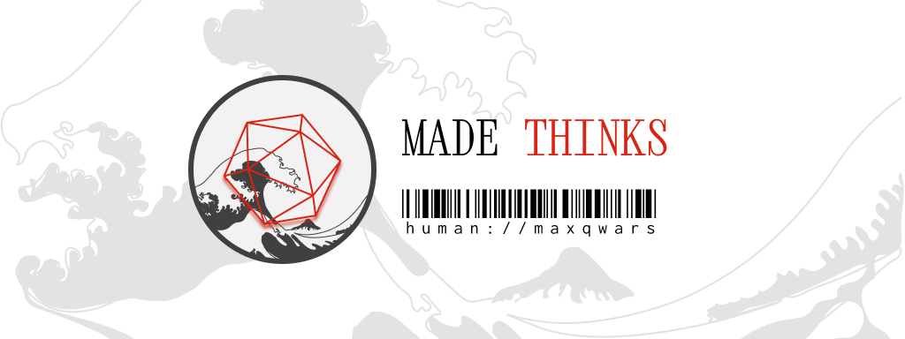

# About me

Hi all, my name is Maxim Maximenko, I am a JavaScript developer. 
I develop web and server projects, write and maintain my own open-source projects.
I use Linux and other open source software in my work.

## Skills ⌨️

## Favorite tools 🔨

## Learn 🔰

## Media Resources

List of my media resources, site for full articles, mastodon for short news summaries

## Contact info

Contact information for suggestions and questions.

## Support

If you found the projects I created useful, you can financially support the author.

